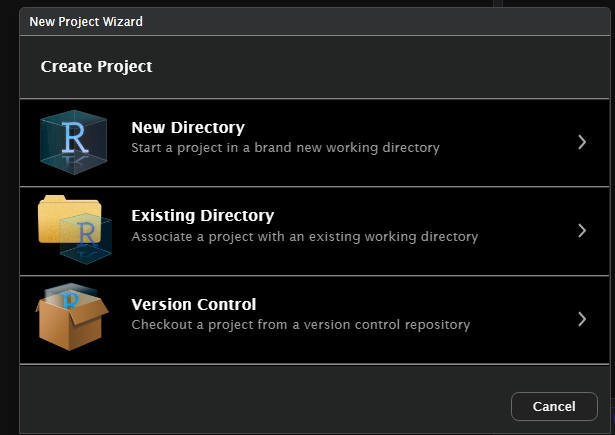
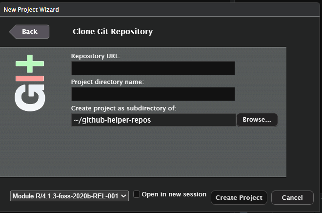

```{r, include = FALSE}
knitr::opts_chunk$set(
  collapse = TRUE,
  comment = "#>"
)
```

## Table of Contents{#toc}  

[Overview](#overview)

[Setup](#setup)

[Create a local repository](#create-repo)

[Setup troubleshooting](#setup-fix)

[Set up Batch processing script](#setup-batch)

[Run Batch Processor](#batch-run)

[Run Batch Processor Troubleshooting](#batch-fix)

# Overview - Background processing of tar files {#overview}

## **Background Processor Overview**

The batch processor allows for the background or foreground processing of multiple source packages in the form of `tar.gz` files to create risk metric data.

The following outlines the steps to set up the `sanofi.risk.metric` package and necessary folders to run this script in Windows.

```{r setup, echo=FALSE}
library(sanofi.risk.metric)
library(knitr)
```

[Return to Table of Contents](#toc)

## Setup - Background processing of tar files {#setup}

| Steps                                                                             | URL                                                                  | Comments                                                                                               |
|------------------------|------------------------|------------------------|
| go to `Sanofi Github`                                                             | \- https://github.com/Sanofi-GitHub <br> - Confidentiality concerns  | \- This will change to open source on GitHub <br> - need to follow `OSPO` guidelines                   |
| get `SSH key` for `sanofi.risk.assessment.tar`                                    | `git@github.com:Sanofi-GitHub/bp-art-sanofi.risk.assessment.tar.git` | \- The package name will change <br> - at the moment, this has two utility functions for tar files     |
| get `SSH key` for `sanofi.risk.metric`                                            | `git@github.com:Sanofi-GitHub/bp-art-sanofi.risk.metric.git`         | \- The package name will change <br> - at the moment, this has two utility functions for tar files     |
| go to `RStudio -> New Project -> Version Control -> Git`                          |   see `Creating a local repository` below                                                                   |                                                                                                        |
| copy `SSH key` to `Repository URL` field                                          |                                                                      |                                                                                                        |
| set up `Create project as subdirectory of`                                        |                                                                      | \- set up project in the `Documents` folder under your user name <br> - This can be in your `OneDrive` |
| go to `Build` Tab and run a `Clean and Install` before running `Document` package |                                                                      | If you run `Document` before `Clean and Install`, it may not work due to permissions problems          |

## Creating a local repository {#create-repo}


1. Create a new project through Version Control





2. Create the R project using the following subdirectory:



This folder structure will help later on when setting other input and output paths.

[Return to Table of Contents](#toc)

## Setup Troubleshooting {#setup-fix}

| Problem | Comments |
|-------|----------|
| cannot find the package |check that the R package is in a folder under `Documents` and has write permissions         |

[Return to Table of Contents](#toc)

# Set up Batch processing script {#setup-batch}

| Steps                                                             | Comments                                                                                                                                         |
|------------------------------------|------------------------------------|
| go to the `Documents` folder under your user name                 |                                                                                                                                                  |
| create a folder `input_bg_data`                                   | \- make sure you have permissions to write to this folder                                                                                        |
| copy `tar.gz` files with R packages to this folder for processing | \- Create these files by: <br> \>    go to the `Build` tab and click `Build Source Package` <br> \>    get `tar.gz` file from `CRAN` or `bioconductor` |
| open `sanofi.risk.assessment.tar` in `RStudio` |    |
| `Clean and Install` this package | |
| `Load All` this package |
| open `sanofi.risk.metric` in `RStudio` |    |
| `Clean and Install` this package | |
| `Load All` this package |

[Return to Table of Contents](#toc)

# Run Batch Processor {#batch-run}

| Steps                       | Comments                                                                   |
|------------------------------------|------------------------------------|
| go to the `inst` folder     |                                                                            |
| open `bgp_proc_tar.R` script |                                                                            |
| `Source as Background Job` the script         | |

[Return to Table of Contents](#toc)

# Run Batch Processor Troubleshooting {#batch-fix}

| Problem | Message | Comments |
|-------|----------| ----------|
| can't find `input_bg_data` folder| `C:/Users/Username/OneDrive/Documents/` <br> `input_bg_data directory exists:` `FALSE` | \- check folder exists <br> - check if you have write permissions for folder <br> - `Restart R`, <br> -`Clean and Install` package <br> - `Load All` package <br> - run script again |
| can't find `inst/results` folder | `C:/Users/Username/OneDrive/Documents/` <br> `bp-art-sanofi.risk.metric/inst/results exists:` `FALSE` | as above |
| can't find `riskdata_results.csv` | data path is `C:/Users/username/OneDrive/` <br> `Documents/bp-art-sanofi.risk.metric/inst/extdata/riskdata_results.csv` <br> data path exists FALSE | as above |
| Error creating `traceability matrix` | Error in `purrr::pmap()` at bp-art-sanofi.risk.metric/inst/bg_proc_tar.R 279 1  <br> ℹ In index: .<br> Caused by error in `FUN()`: <br> lazy-load database `C:/Users/username/AppData/Local/R/win-library/4.4/waldo/help/waldo.rdb` is corrupt | as above |
| Question about deletion of `inst/doc` | Building the package will delete... <br> `C:/Users/username/AppData/Local/Temp/` <br> `RtmpuktlPk/temp_file_230431af9da/synapser/inst/doc` Are you sure? | 1 `Yes` |


[Return to Table of Contents](#toc)